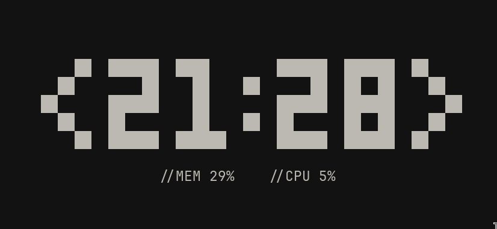

# &lt;/VDB-CLOCK&gt;



A TUI **(Text-based User Interface)** clock with memory usage and cpu usage.
<br>

# </How to install?>

## //Linux

Open a terminal in the folder and run this command:

```bash
chmod +x install.sh
./install.sh
```

After that you can run "vdb-clock" in the terminal.

```bash
vdb-clock
```

## //Windows / MacOs

I'm too lazy to add a Windows/MacOs install script, so you're on your own. :)
<br>
But normally the vdb-clock should work on those platforms as well.

# &lt;/IMPORTANT&gt;
There is one thing I didn't think about is if your terminal has a different bg color then mine.<br>
So if you try this out with a terminal with another color it will not look good. It will have this black box inside of the terminal!

<br>

**You can ofcourse fix this by just changing the css in the app.py file and reinstalling it!**
